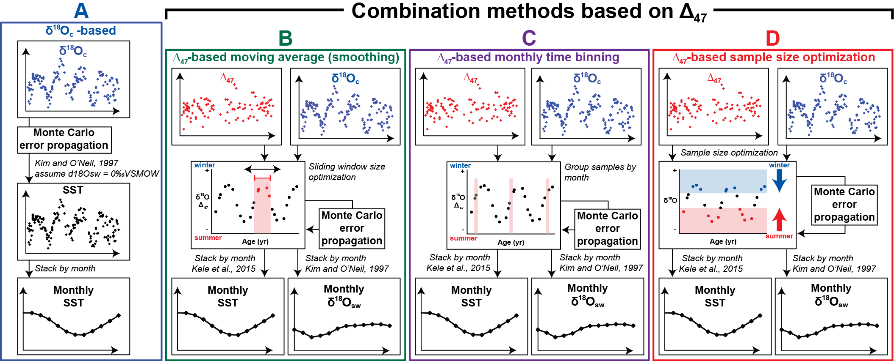
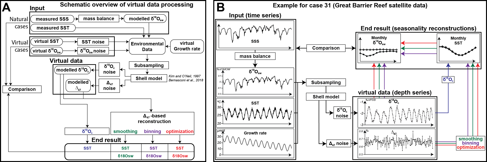
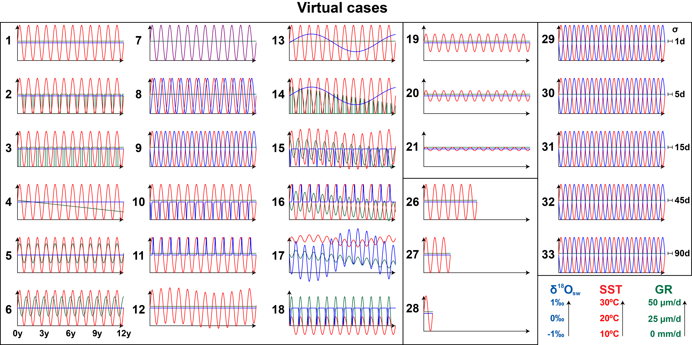
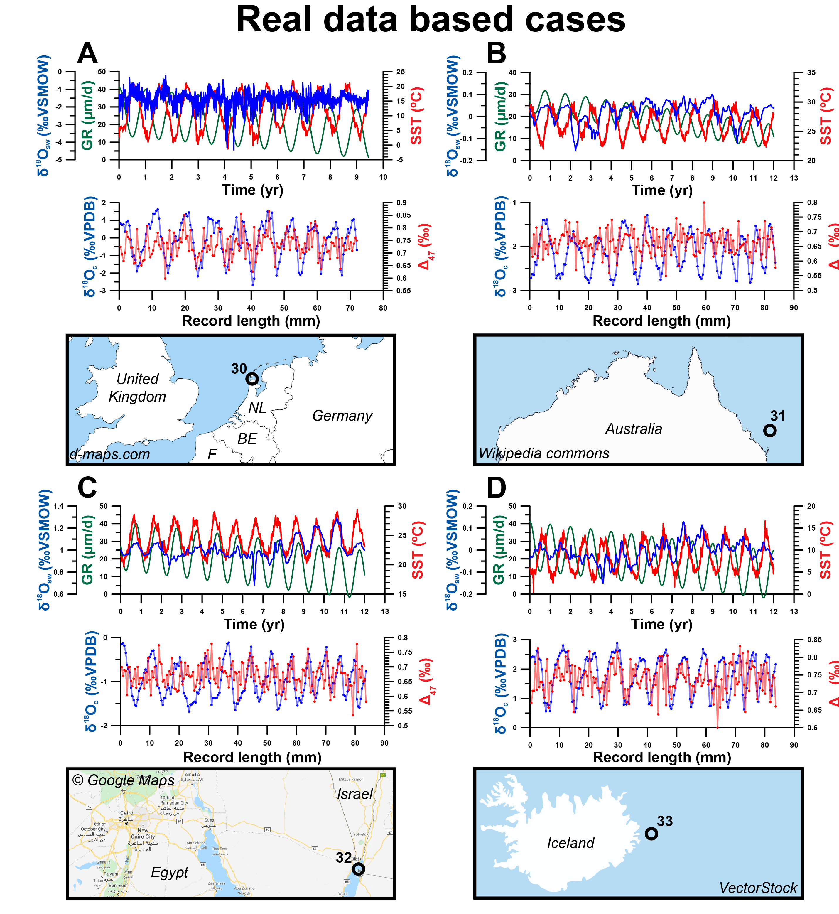

<!-- README.md is generated from README.Rmd. Please edit that file -->

```{r, include = FALSE}
knitr::opts_chunk$set(
  collapse = TRUE,
  comment = "#>",
  fig.path = "man/figures/README-",
  out.width = "100%"
)
```

# **seasonalclumped**

<!-- badges: start -->
<!-- badges: end -->

The **seasonalclumped** package compiles functions that can be used for seasonal climate reconstructions from clumped isotope analyses.
The **seasonalclumped** functions use stable oxygen isotope records (δ18O) and clumped isotope records (Δ47) from seasonal paleo-archives to reconstruct seasonal temperature and salinity (δ18O value of the water from which the archive was precipitated) variability.
In addition, **seasonalclumped** includes a list of 33 test cases that were used to test different methods for extracting seasonal reconstructions from these high-resolution isotopic datasets.
It also contains functions used to create these virtual carbonate records, and which can be used to produce records for testing reconstruction approaches in the future.
More information about these tests can be found in:

de Winter, N.J., Agterhuis, T.A., Ziegler, M., Optimizing sampling strategies in high-resolution paleoclimate records, _Climate of the Past Discussions_ **2020**, _cp-2020-118_.
\url{http://dx.doi.org/10.5194/cp-2020-118}

In short, **seasonalclumped** compiles two types of functions:

Firstly, it contains four functions that can be used to extract seasonal reconstruction data from stable oxygen isotope records (δ18O) and clumped isotope records (Δ47) from seasonal paleo-archives.
These functions take stable oxygen isotope (δ18O) and clumped isotope (Δ47) data alighned to a sub-annual age model, and use this data to extract seasonal temperature and δ18Ow (δ18O value of the precipitation fluid) reconstructions.
For more information about constructing sub-annual resolved age models in these types of records, please refer to the ShellChron package (\url{https://cran.r-project.org/web/packages/ShellChron/index.html})
All seasonal reconstruction functions form solutions to the problem of effectively combining high-resolution Δ47 measurements (which, by themselves, have a large uncertainty) for accurate sub-annual temperature reconstructions.
Three such functions are included, and a schematic summary of these functions is provided in Figure 1:

1. The _oxygen_isotope_seasonality()_ function only takes δ18O data and a user-provided assumption of the height and variability of the δ18Ow value to calculate sub-annual temperature variability.

2. The _smoothing_seasonality()_ function takes both δ18O and Δ47 data and applies a moving average-based smoothing to combine aliquots of both isotopic variables to reduce uncertainty on sub-annual reconstructions. The size of the moving window can either be provided by the user, or an optional Monte Carlo-based optimization approach can be applied to find the optimum size of the window to be used for smoothing ("optimize" option in \code{window} parameter)

3. The _binning_seasonality()_ function takes both δ18O and Δ47 data and groups these measurements in time bins before calculating temperature and δ18Ow to reduce uncertainty on sub-annual reconstructions. The bin size can be selected by the user (monthly and three-monthly bins are currently supported)

4. The _optimization_seasonality()_ function takes both δ18O and Δ47 data and groups these measurements in seasonal bins before calculating temperature and δ18Ow to reduce uncertainty on sub-annual reconstructions. The binning in this function is guided by an optimization approach that employs an expanding-window T-test grouping δ18O and Δ47 measurements in summer and winter groups based on the seasonality in δ18O and disentangles the relationship between \eqn{\Delta^{18}O_w}{δ18O} and temperature that drives changes in δ18O and Δ47 through a dynamic Monte Carlo simulation approach. In the end, this relationship is used in combination with the user-provided ages of the samples to produce monthly \eqn{\Delta^{18}O_w}{δ18O} and temperature reconstructions.



The second set of functions ("carbmodel()" and "subsample()") allows the user to produce virtual carbonate isotope records from pre-defined temperature and salinity (δ18Ow) records in the time domain.
Examples of how this set of functions is used to produce a large array of virtual datasets are provided in the "data_raw" folder.
In brief, this workflow subsamples the provided temperature and δ18Ow data using a user-provided growth rate record of the same length ("subsample()" function).
It then uses empirical transfer functions linking δ18O and Δ47 to the temperature and δ18Ow of the precipitation fluid to produce virtual carbonate isotope records based on the data ("carbmodel()" function).
Empirical transfer functions used in the carbmodel() function were sources from the following publications:

Grossman, E.L., Ku, T., Oxygen and carbon isotope fractionation in biogenic
aragonite: temperature effects, _Chemical Geology_ **1986**, _59.1_, 59-74.
    \url{http://dx.doi.org/10.1016/0168-9622(86)90057-6}

Kim, S., O'Niel, J.R., Equilibrium and nonequilibrium oxygen
isotope effects in synthetic carbonates, _Geochimica et Cosmochimica Acta_
**1997**, _61.16_, 3461-3475.
    \url{http://dx.doi.org/10.1016/S0016-7037(97)00169-5}

Dettman, D.L., Reische, A.K., Lohmann, K.C., Controls on the stable isotope
composition of seasonal growth bands in aragonitic fresh-water bivalves
(Unionidae), _Geochimica et Cosmochimica Acta_ **1999**, _63.7-8_, 1049-1057.
    \url{http://dx.doi.org/10.1016/S0016-7037(99)00020-4}

Brand, W.A., Coplen, T.B., Vogl, J., Rosner, M., Prohaska, T., Assessment of
international reference materials for isotope-ratio analysis (IUPAC Technical
Report), _Pure and Applied Chemistry_ **2014**, _86.3_, 425-467.
    \url{http://dx.doi.org/10.1515/pac-2013-1023}

Kele, S., Breitenbach, S. F., Capezzuoli, E., Meckler, A. N., Ziegler, M.,
Millan, I. M., Kluge, T., Deák, J., Hanselmann, K. and John, C. M.,
Temperature dependence of oxygen-and clumped isotope fractionation in
carbonates: a study of travertines and tufas in the 6–95 C temperature range,
_Geochimica et Cosmochimica Acta_ **2015**, 168, 172–192.
    \url{http://dx.doi.org/10.1016/j.gca.2015.06.032}

Bernasconi, S.M., Müller, I.A., Bergmann, K.D., Breitenbach, S.F., Fernandez,
A., Hodell, D.A., Jaggi, M., Meckler, A.N., Millan, I. and Ziegler, M.,
Reducing uncertainties in carbonate clumped isotope analysis through
consistent carbonate‐based standardization. _Geochemistry, Geophysics,
Geosystems_ **2018**, 19-9, 2895-2914.
    \url{http://dx.doi.org/10.1029/2017GC007385}

Petersen, S. V., Defliese, W. F., Saenger, C., Daëron, M., Huntington, K. W.,
John, C. M., Kelson, J. R., Bernasconi, S. M., Colman, A. S., Kluge, T.,
Olack, G. A., Schauer, A. J., Bajnai, D., Bonifacie, M., Breitenbach, S. F.
M., Fiebig, J., Fernandez, A. B., Henkes, G. A., Hodell, D., Katz, A., Kele,
S., Lohmann, K. C., Passey, B. H., Peral, M. Y., Petrizzo, D. A., Rosenheim,
B. E., Tripati, A., Venturelli, R., Young, E. D. and Winkelstern, I. Z.,
Effects of Improved 17O Correction on Interlaboratory Agreement in Clumped
Isotope Calibrations, Estimates of Mineral-Specific Offsets, and Temperature
Dependence of Acid Digestion Fractionation, _Geochemistry, Geophysics,
Geosystems_ **2019*, 20-7, 3495–3519.
    \url{http://dx.doi.org/10.1029/2018GC008127}

Jautzy, J. J., Savard, M. M., Dhillon, R. S., Bernasconi, S. M. and Smirnoff,
A., Clumped isotope temperature calibration for calcite: Bridging theory and
experimentation, _Geochemical Perspectives Letters_ **2020**, 14, 36–41.
    \url{http://dx.doi.org/10.7185/geochemlet.2021}


An overview of the full workflow of producing data from virtual temperature, growth rate and δ18Ow records and using the functions listed above for seasonality reconstructions is shown in Figure 2.



An overview of the temperature, growth rate and δ18Ow records used to create the virtual δ18O and Δ47 datasets provided in this package is shown in Figure 3.



In addition to virtual datasets, four real-world temperature and δ18Ow records are provided (see Figure 4)
For details on these datasets, please refer to "Case 22-25" in the data folder as well as external data provided with the package.




## Installation

You can install the released version of **seasonalclumped** from [CRAN](https://CRAN.R-project.org) with:

``` r
install.packages("seasonalclumped")
```

And the development version from [GitHub](https://github.com/) with:

``` r
# install.packages("devtools")
devtools::install_github("nielsjdewinter/seasonalclumped")
```
## Example

These are basic examples which show you how to produce a virtual isotopic datasets using the functions provided in the package and how to reconstruct seasonal temperature and δ18Ow variability from isotopic datasets using the _optimization_seasonality()_ function provided in the package:

```{r, eval=FALSE, examples}
## Example 1 (creating virtual data)

require(seasonalclumped)

# Create Case 1 virtual dataset

# Set boundary conditions
Td <- seq(1, 12 * 365, 1) # Create timeline of 12 years in days
Ty <- Td / 365 # Convert to years
MAT <- 20 # Set mean annual temperature
Amp <- 10 # Set seasonal amplitude
Sext <- 2 * Amp # Calculate extent of seasonal variability

TSD <- 1.5 # Set the degree of random non-seasonal noise on the SST curve ("weather")
SST <- rnorm(length(Ty), MAT + Amp * sin(2 * pi * Ty), TSD) # Create virtual daily SST data
GR <- rep(10 / 365, length(Ty)) # Set growth rate to 10 mm/yr and create daily GR vector
DSD <- 0.6 # Set the degree of random non-seasonal noise on the d18Osw curve ("salinity fluctuations")
d18Osw<-rnorm(length(Ty), rep(0, length(Ty)), DSD) # Set d18Osw to 0 permille VSMOW, create daily d18Osw vector
SR <- 0.75 # Set sampling resolution to 0.75 mm

# Create vector for all samples along entire shell length by applying constant sampling resolution
D <- seq(SR, sum(GR), SR)

# Calculate virtual data
newdata <- carbmodel(Ty, SST, GR, d18Osw, D, AV = TRUE)

## Example 2 (producing sub-annual reconstructions)

# find attached dummy data
Case1 <- newdata
d18Oc <- Case1[, 3]
d18Oc <- d18Oc[-which(is.na(d18Oc))]
D47 <- Case1[, 4]
D47 <- D47[-which(is.na(D47))]
ages <- Case1[, 1]
ages <- ages[-which(is.na(ages))]

# Run function
monthly <- optimization_seasonality(d18Oc,
D47,
ages,
0.1,
0.04,
1000,
0.05,
"KimONeil97",
"Bernasconi18",
FALSE,
FALSE
)
